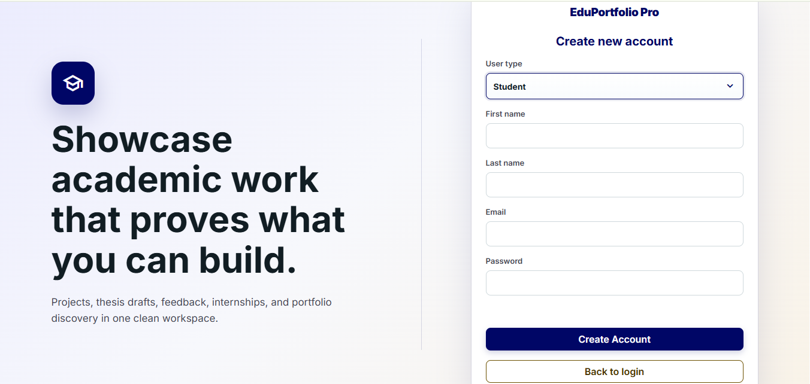
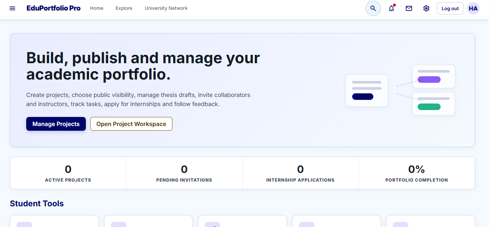
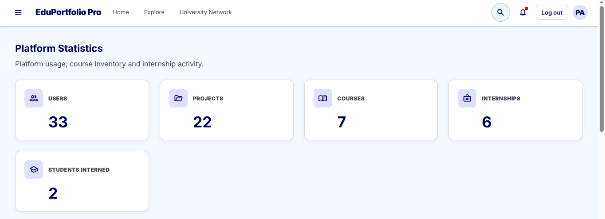
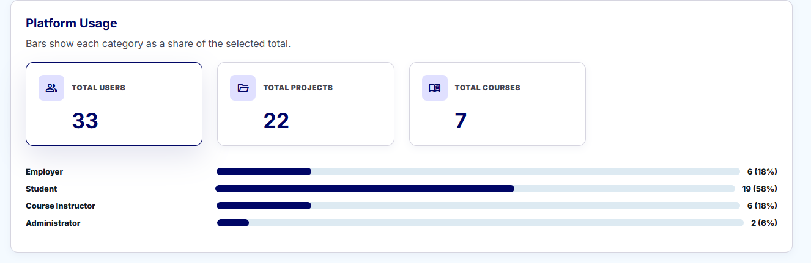
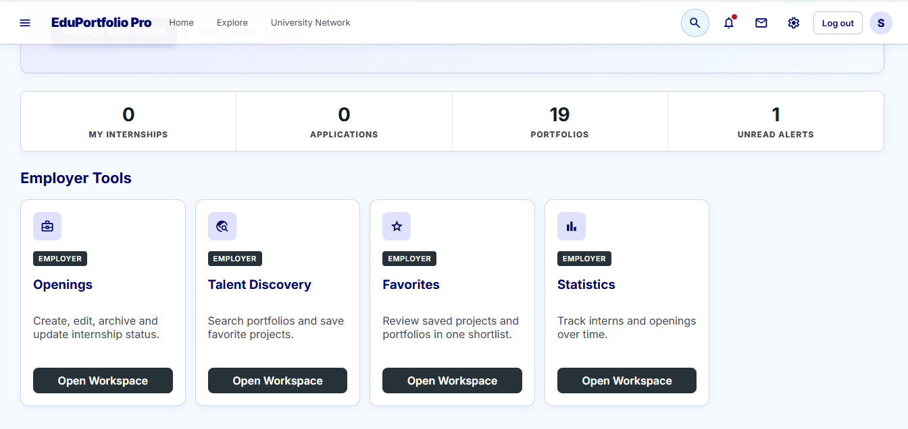
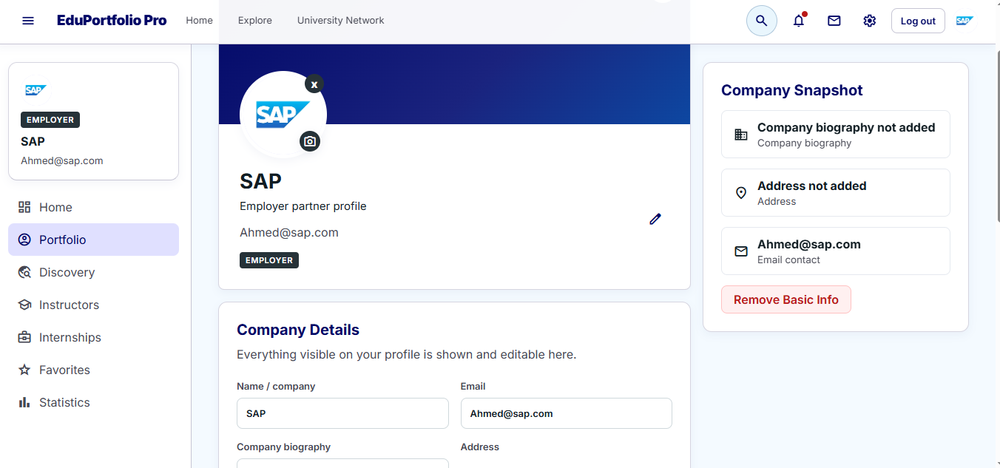
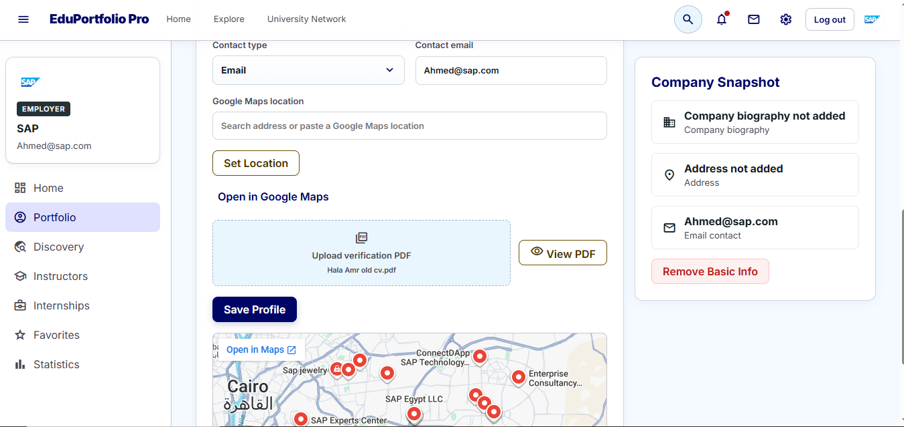

# Talent Hub

A React web app where students showcase their projects and build portfolios, and employers can discover and connect with talent.

## Features
- Student profiles and project portfolios
- Employer discovery and search
- Authentication and role switching
- Project CRUD, thesis drafts, and invitations
- Messaging, notifications, and recommendations

## Tech Stack
- React
- JavaScript
- CSS

## Run Locally
npm install

npm run dev

## Snippets of the Website

##SignUp

##Student Home Page

##Admin Statistics

##Employer Home Page & Profile

